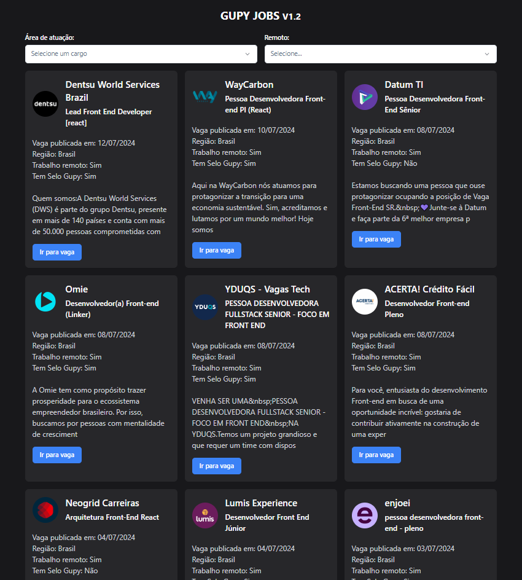

<a href="https://github.com/filipeleonelbatista/gupy-jobs-svelte/blob/master/README_EN.md" target="_blank">
  
  Version in English
</a>
</br>
</br>



# Indice

- [Sobre](#-sobre)
- [Tecnologias](#Tecnologias)
- [Instalação](#Instalação)

## 🔖&nbsp; Sobre

Aplicativo para listar as vagas disponíveis na gupy com algumas opções

[Link do Site](https://gupy-jobs-svelte.vercel.app/)

## Objetivo

Criei este app para ajudar a encontrar vagas rapidamente na plataforma da gupy. Este app filtra vagas por tipo remoto ou não e por foco de desenvolvimento front-end back-end ou full-stack.
 
---
## Tecnologias

Esse projeto foi desenvolvido com as seguintes principais tecnologias:

- [Svelte Kit](https://kit.svelte.dev/)
- [TailwindCSS](https://tailwindcss.com/)
- [Typescript](https://www.typescriptlang.org/)
- [Shadcn UI Svelte](https://www.shadcn-svelte.com/)

e mais...

---
## Instalação

O projeto roda com [Node.js](https://nodejs.org/) v20+.

Instruções para instalar as dependencias e inicie o projeto.

```sh

cd gupy-jobs-svelte
npm i
npm run dev

```
---

<h3 align="center" >Vamos nos conectar 😉</h3>
<p align="center">
  <a href="https://www.linkedin.com/in/filipeleonelbatista/">
    
  </a>&ensp;
  <a href="mailto:filipe.x2016@gmail.com">
    
  </a>&ensp;
  <a href="https://instagram.com/filipeleonelbatista">
    
  </a>
</p>
<br />
<p align="center">
    Desenvolvido 💜 por Filipe Batista 
</p>
