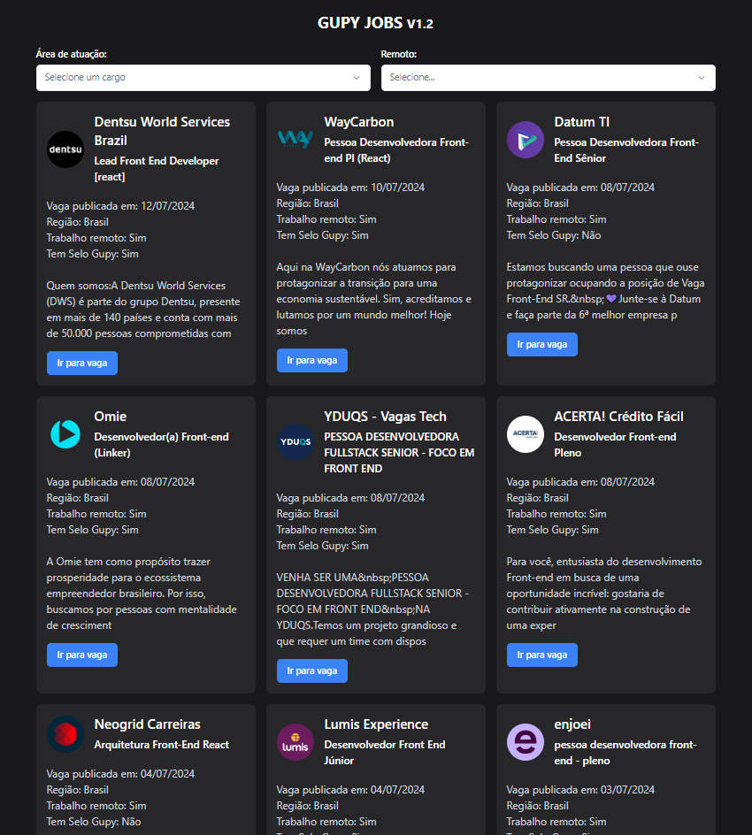

<a href="https://github.com/filipeleonelbatista/gupy-jobs-svelte/blob/master/README.md" target="_blank">
  
  Version in Brasilian Portuguese
</a>
</br>
</br>



# Index

- [About](#-about)
- [Technologies](#Technologies)
- [Installation](#Installation)

## 🔖&nbsp; About

Application to list available vacancies at gupy with some options

[Website Link](https://gupy-jobs-svelte.vercel.app/)

A fork developed with svelte from [birobirobiro](https://github.com/birobirobiro/gupy-jobs)'s repository.

## Objective

Create this app to help you quickly find vacancies on the gupy platform. This application filters vacancies by remote or non-remote type and by front-end, back-end or full-stack development focus.
 
---

## Technologies

This project was developed with the following main technologies:

- [Svelte Kit](https://kit.svelte.dev/)
- [TailwindCSS](https://tailwindcss.com/)
- [Typescript](https://www.typescriptlang.org/)
- [Shadcn UI Svelte](https://www.shadcn-svelte.com/)

and more...

---
## Installation

The project runs with [Node.js](https://nodejs.org/) v20+.

Instructions to install dependencies and start the project.

```sh

cd gupy-jobs-svelte
npm i
npm run dev

```

---

<h3 align="center" >Vamos nos conectar 😉</h3>
<p align="center">
  <a href="https://www.linkedin.com/in/filipeleonelbatista/">
    
  </a>&ensp;
  <a href="mailto:filipe.x2016@gmail.com">
    
  </a>&ensp;
  <a href="https://instagram.com/filipeleonelbatista">
    
  </a>
</p>
<br />
<p align="center">
    Desenvolvido 💜 por Filipe Batista 
</p>
